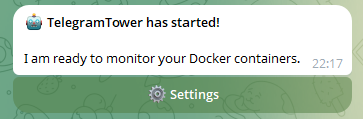
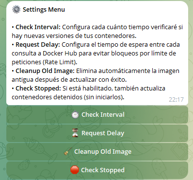
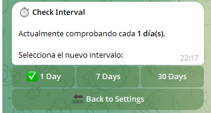

# TelegramTower 🗼

TelegramTower is a lightweight, Watchtower-inspired Docker container update manager that puts you in control. Instead of updating containers automatically and silently in the background, TelegramTower notifies you via Telegram and lets you approve updates with a single tap.

## Features

* **Manual Approval:** Receive interactive Telegram messages when an update is available. Choose to Update or Ignore directly from the chat.
* **Compose & Network Aware:** Preserves Docker Compose labels and multiple network attachments when recreating containers, preventing broken stacks.
* **Dynamic Configuration:** Adjust settings like polling intervals and delays directly from an interactive Telegram menu without restarting the bot.
* **GHCR Support:** Seamlessly works with GitHub Container Registry, Docker Hub, and private registries.
* **Exclude Containers:** Easily exclude specific containers from updates using standard labels.

## Web Dashboard

TelegramTower includes a built-in Web Dashboard available at port `8080`.
* **Global Overview:** View all your containers, their current status, auto-update settings, and quarantine time left at a glance.
* **Token Management:** Configure your `TELEGRAM_BOT_TOKEN` directly from the web interface (any conflicts with environment variables will be highlighted).
* **Security:** Protect the dashboard with Basic Auth by setting `WEB_USER` and `WEB_PASSWORD` environment variables.

## Previews

| Startup & Main Menu | Settings Details | Check Interval Selection |
|:---:|:---:|:---:|
|  |  |  |

## Quick Start

### 1. Prerequisites
1. Talk to [@BotFather](https://t.me/botfather) on Telegram to create a bot and get your `TELEGRAM_BOT_TOKEN`.
2. Get your Chat ID (you can use a bot like @userinfobot) for `TELEGRAM_CHAT_ID`.

### 2. Run with Docker Compose

Create a `docker-compose.yml` file:

```yaml
services:
  telegramtower:
    image: uniextra/telegramtower:latest
    container_name: telegramtower
    restart: unless-stopped
    ports:
      - "8080:8080"
    volumes:
      - /var/run/docker.sock:/var/run/docker.sock
      - ./telegramtower_data:/app/data
    environment:
      - TELEGRAM_BOT_TOKEN=your_bot_token_here
      - TELEGRAM_CHAT_ID=your_chat_id_here
      # Optional: Secure the web dashboard
      - WEB_USER=admin
      - WEB_PASSWORD=secret_password
```

Then run:
```bash
docker-compose up -d
```

### 3. Exclude Containers
To prevent TelegramTower from monitoring specific containers, add one of the following labels to your container's compose file or run command:
* `telegramtower.enable=false`
* `com.centurylinklabs.watchtower.enable=false` (Supported for easy migration from Watchtower)

### 4. Auto-Update Containers
If you want specific containers to bypass the manual approval process and update automatically whenever a new version is found, you can do this in two ways:
1. Click the **[ 🔄 Auto-Update ]** button on a Telegram notification when an update is available.
2. Add the following label to the container's compose file or run command:
* `telegramtower.autoupdate=true`

Example in `docker-compose.yml`:
```yaml
services:
  my_app:
    image: nginx:latest
    labels:
      - "telegramtower.enable=false"
      # Or for auto-updating:
      # - "telegramtower.autoupdate=true"
```

## Settings Configuration
The bot has a robust `/settings` menu built right into Telegram. You can configure:
- **Check Interval:** How often to check for updates (1, 7, or 30 days).
- **Request Delay:** Wait time between checks (0s, 2s, 5s) to avoid Docker Hub rate limits.
- **Cleanup Old Image:** Automatically delete old images after a successful update.
- **Check Stopped:** Include stopped containers in the update checks.
- **Quarantine Delay:** Delay update notifications for a specified number of days (1, 3, 5, 7 days) to ensure stability and protect against "day 0" bugs or compromised tags. If an image is updated 3 times rapidly during this period, you will receive a manual review warning.

### Container-Specific Quarantine
You can override the global Quarantine setting for specific containers by adding the `telegramtower.quarantine` label. Set the value to the number of days to wait, or `0` to bypass the delay entirely:
```yaml
services:
  my_app:
    image: nginx:latest
    labels:
      - "telegramtower.quarantine=5" # Wait 5 days for this specific container
```

## License
This project is open source and available under the [MIT License](LICENSE).
